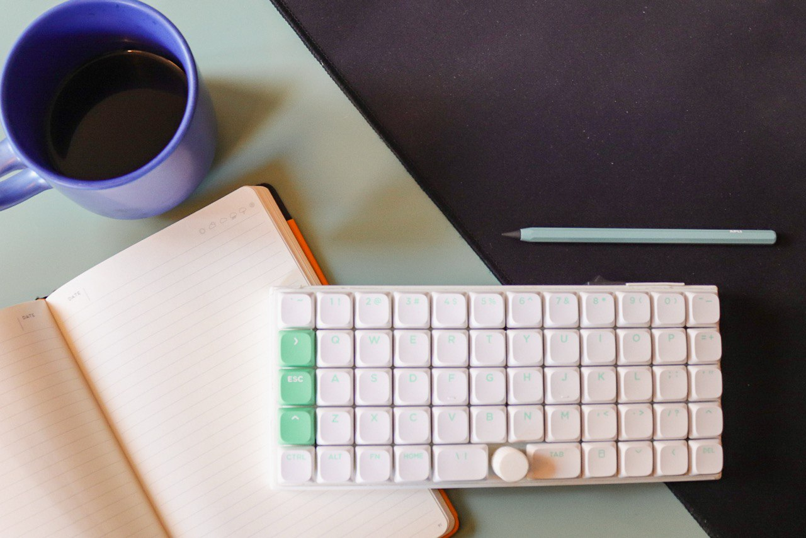
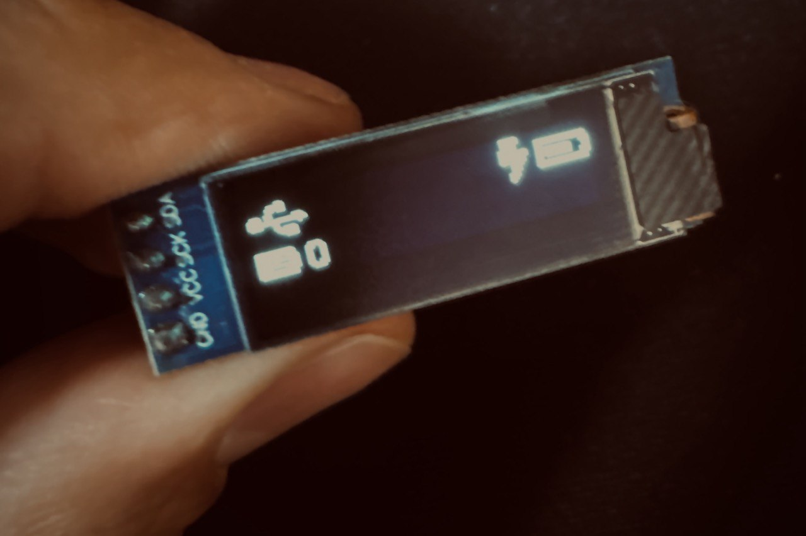

# Matcha59 🍵  
### Handwired Mechanical Keyboard with nRF52840 Controller and ZMK Firmware

---

## 🧠 Overview

**Matcha59** is a custom **handwired 59-key mechanical keyboard**, built entirely from scratch.  
It uses a **SuperMini nRF52840** as its controller and **Nuphy Aloe Low Profile switches**, providing a smooth and lightweight typing experience.

The keyboard features:
- **3D printed case**, based on the original design by[([rykb](https://www.thingiverse.com/thing:4850429))]  
- **Custom ZMK fork** with **OLED display support**  
- **Encoder support**
- **Bluetooth Low Energy (BLE)** wireless connectivity via nRF52840  

The keyboard is **currently fully functional**, though a dongle/addon for the screen has to be designed yet :).

---

## 🧩 Technical Specifications

| Component | Description |
|------------|-------------|
| **Controller** | SuperMini nRF52840 |
| **Firmware** | ZMK (custom fork) |
| **Keys** | 59 (compact / ortholinear layout) |
| **Switches** | Nuphy Aloe Low Profile |
| **Display** | OLED display |
| **Connectivity** | Bluetooth Low Energy (BLE) |
| **Battery** | 200mAh battery

---

## 🛠️ Assembly

1. 3D print the case (see [model]](https://www.thingiverse.com/thing:4850429)]).  
2. Handwire the matrix (rows and columns).  
3. Solder the **SuperMini nRF52840** controller.  
4. Flash the **ZMK firmware** compiled with BLE and OLED support.  
5. Assemble the keyboard and test all keys.  

---

## 📷 Gallery

---

## ⚙️ Firmware (ZMK)

The **Matcha59** runs on a **custom fork of ZMK** firmware, providing:
- OLED display support  
- Compact 59-key layout  
- Multi-profile BLE connection support  

## 🧾 License

This is a personal project by Manel Cerezo.
Firmware and documentation are released under the MIT License.
3D case design credited to the original author — ([Thingiverse Link](https://www.thingiverse.com/thing:4850429))
.

## 🙏 Credits

ZMK Firmware
 [– For the open-source keyboard firmware](https://zmk.dev/)

ZMK [Discord](https://zmk.dev/community/discord/invite) Help Community
– Thanks for the help on screen troubleshooting :)

[rykb Case Designer](https://www.thingiverse.com/thing:4850429)
